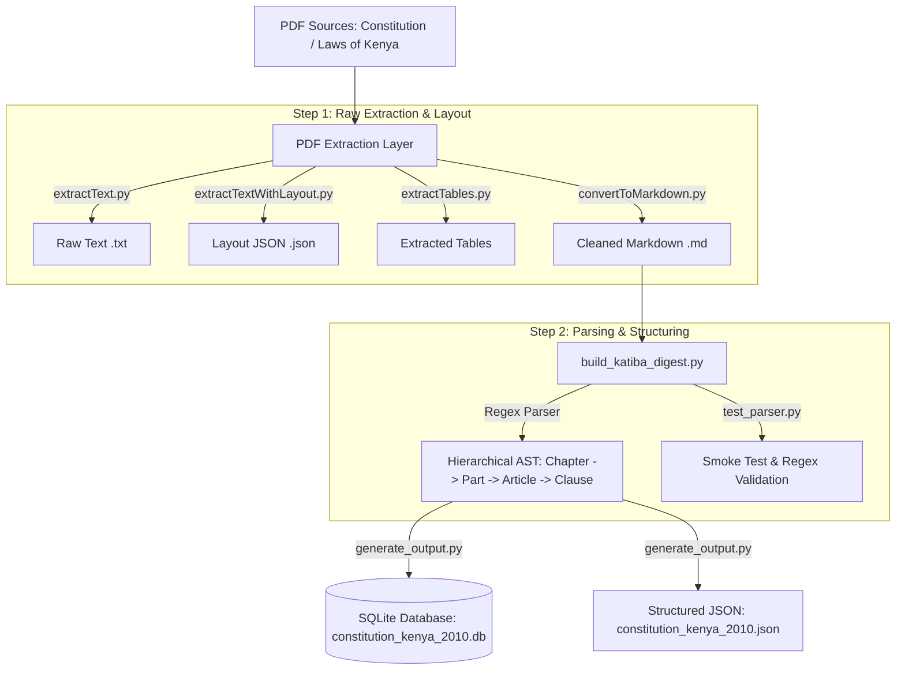

<p align="center">
  
</p>

<h1 align="center">ke-katiba-digest</h1>

<p align="center">
  <strong>A modern, high-performance extraction and structuring pipeline for the Constitution of Kenya (2010).</strong>
</p>

<p align="center">
  <a href="#architecture--data-flow">Architecture</a> •
  <a href="#getting-started">Getting Started</a> •
  <a href="#usage-guide">Usage</a> •
  <a href="#code-quality--engineering-standards">Standards</a> •
  <a href="#schema-overview">Schema</a>
</p>

---

## Overview

`ke-katiba-digest` converts raw, multi-column statutory PDF documents into clean, structured AST representations. It parses legal hierarchies (**Chapter → Part → Article → Clause**) and serializes them into production-ready **JSON** and **SQLite** databases for downstream legal tech applications, search engines, and LLM indexing.

---

## Architecture & Data Flow



---

## Directory Structure

```
ke-katiba-digest/
├── build_katiba_digest.py      # Core parser: AST builder & text cleanup pipeline
├── convertToMarkdown.py        # PDF -> Markdown conversion CLI
├── extractTables.py            # PDF tabular data extraction module
├── extractText.py              # Baseline text extraction CLI
├── extractTextWithLayout.py    # Layout-aware PDF text and bounding box extractor
├── generate_output.py          # Exporter to SQLite (.db) and structured JSON (.json)
├── pdf_utils.py                # Shared PDF processing & PyMuPDF/pdfplumber utilities
├── renderPageToImage.py        # Page rendering engine for inspection/visual audit
├── test_parser.py              # CLI test suite for regex verification & pipeline validation
├── data/                       # Source documents & runtime assets
│   ├── LAWS-OF-KENYA-BOOKLET.pdf
│   ├── The_Constitution_of_Kenya_2010.pdf
└── output/                     # Production artifacts & execution logs
    ├── constitution_kenya_2010.db
    ├── constitution_kenya_2010.json
    ├── convertToMarkdown_*.log
    ├── convertToMarkdown_*.md
    ├── extractTextWithLayout_*.json
    └── extractText_*.txt
```

---

## Code Quality & Engineering Standards

The codebase is engineered around standard Python 3.10+ production patterns, as benchmarked in `test_parser.py` (continued refactoring in progress to ensure full coverage):

* **Structured Logging over Bare Print**: All modules use `logging.getLogger(__name__)` with configurable levels (`--log-level DEBUG|INFO|WARNING|ERROR`).
* **Strong Type Annotations & Dataclasses**: Immutable objects defined via `@dataclass(frozen=True)` and strict type hints (`Path`, `tuple`, `list[str]`, `list[str] | None`).
* **Defensive Path Resolution & Fallbacks**: Fallback search strategies for inputs, avoiding brittle hardcoded paths.
* **Targeted Error Handling**: Domain-specific exception handling (`RuntimeError`, `FileNotFoundError`) isolating UTF-8 decodes, missing files, or empty outputs.
* **CLI Standards**: Standard `argparse` CLI wrappers returning deterministic exit codes (`0` for success, non-zero for failure).

---

## Getting Started

### Prerequisites

* **Python**: `3.10+`
* **Virtual Environment**: Recommended (`venv` or `uv`)

### Installation

```bash
# Clone repository
git clone https://github.com/kibdev/ke-katiba-digest.git
cd ke-katiba-digest

# Create and activate virtual environment
python3 -m venv .venv
source .venv/bin/activate

# Install dependencies (PyMuPDF, pdfplumber, etc.)
pip install -r requirements.txt
```

---

## Usage Guide

### 1. Extract & Convert PDF to Markdown
```bash
python convertToMarkdown.py --input data/The_Constitution_of_Kenya_2010.pdf --output-dir output
```

### 2. Validate Regex & Parsing Logic
Run the parser smoke test to verify match counts and line regex alignment:
```bash
# Test using automated fallback or explicit path
python test_parser.py --log-level INFO

# Test against a specific converted markdown file
python test_parser.py --md-file output/convertToMarkdown_lok-bk_2026-Jul-26_h23m54s15-606_33261.md
```

### 3. Build & Generate Structured Outfiles
Build the structured AST and emit both SQLite and JSON databases:
```bash
python build_katiba_digest.py
python generate_output.py
```

---

## Schema Overview

### JSON Schema Structure
```json
{
  "title": "Constitution of Kenya, 2010",
  "chapters": [
    {
      "number": "ONE",
      "title": "SOVEREIGNTY OF THE PEOPLE AND KUKUU",
      "articles": [
        {
          "number": "1",
          "title": "Sovereignty of the people",
          "clauses": [
            "(1) All sovereign power belongs to the people of Kenya..."
          ]
        }
      ]
    }
  ]
}
```

### SQLite Schema (`constitution_kenya_2010.db`)
* **`chapters`**: `(id INTEGER PRIMARY KEY, number TEXT, title TEXT)`
* **`parts`**: `(id INTEGER PRIMARY KEY, chapter_id INTEGER, number INTEGER, title TEXT)`
* **`articles`**: `(id INTEGER PRIMARY KEY, chapter_id INTEGER, part_id INTEGER, number INTEGER, title TEXT)`
* **`clauses`**: `(id INTEGER PRIMARY KEY, article_id INTEGER, clause_number INTEGER, text TEXT)`

---

## License & Attribution

Distributed under the MIT License. Data source derived from public domain legal texts of the Republic of Kenya.
